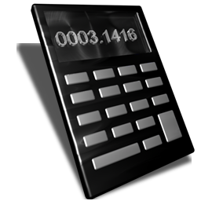

# Simple Calculator [](https://travis-ci.org/raulh82vlc/SimpleCalculator)
Simple calculator is a simple calculator with only addition and subsctraction, using decimals as well.
 This project uses *Clean architecture* by means of *Model-View-Presenter (MVP)*
as well as `Dagger 2` for *Dependency Injection*, trying to respect *SOLID principles* as much as possible.

### Logo


## Overview
At this open-source project, it is decoupled between `android` and `domain` modules or high level layers.

This means, `android` is strongly coupled with the Android framework and `domain` is decoupled from it, and can be re-used for other purposes when
required as is purely *Java* based, but not framework coupled.

## Architecture design overview
The exchange between the different *layers* is as follows:
- **Interactor layer**: from the *Interactor*, which is responsible of the *business logic* and communicating results to the *Presenter*
- **Presenter layer**: from the *Presenter*, which orchestrates different interactors when required and also provides the final formatted info to a passive `View` from a UI element (fragments / activities).
Finally, this information would be passed through the UI thread.


### Material design
- This code test uses a wide range of Material design widgets from the Design support library such as:
- `AppBarLayout`, `CoordinatorLayout`, `Toolbar`, as well as Material theme styles.

### Features
- When the app opens a calculator interface is displayed to the user.
- The calculator should have buttons for:
 - Numbers 0 to 9
 - Decimal point
 - Addition
 - Subtraction
 - Equals (to see the result)
- As the buttons are pressed, they are entered into the output view at the top.
- Once, the user presses the “=” key, then the result is computed and displayed in the output field.
 - For example: For input: 1 2 + 6 5 - 7 Then, the output view would now display: 12+65-7
 - When “=” is pressed, the output view would now display: 70
 - After the result has been calculated if either “+” or ”-” is selected, then this operation will be applied to the result currently displayed in the output view.
 - For example: The output view currently displays: 70
 - For input: + 1 6 - 2 Then, the output view would now display: 70+16-2
 - When “=” is pressed, the output view would now display: 84
- A Loader is placed each time a read of operations or calculation is started, to indicate the user the fact that there is an action going on (when too quick is not visible)
- There are Unit test cases for the most critical parts:
 - The strategy for calculating after and parsing inputs from the screen (domain)
 - Characters validation for combinations like:
  - user press + & + then only one + is on screen
  - user press + & - then only one - is on screen
  - user press - & - then only one + is on screen
  - user press . with a + before, then 0. is on screen
 - Strings transformation tests for checking correctness
- Includes a < which is responsible of cleaning the screen when something is wrong or starting a new operation

### SDK support
Support SDKs from **16** to **25**

# Disclosure - Libraries used
- [Dagger 2](http://google.github.io/dagger) for Dependency Injection
- [ButterKnife](http://jakewharton.github.io/butterknife) v6.1.0 for Views Injection
- [Mockito](http://site.mockito.org/) for Mocking artifacts
- [JUnit](http://junit.org/) for Unit tests

# References (special thanks) - those are the same I indicated at my personal blog ([Insights and projects](https://raulh82vlc.github.io/Movies-Finder)): 
- [Uncle Bob: The Clean Architecture](https://blog.8thlight.com/uncle-bob/2012/08/13/the-clean-architecture.html) by Uncle Bob
- [The Repository pattern](https://msdn.microsoft.com/en-us/library/ff649690.aspx) by Microsoft
- [Effective Android UI](https://github.com/pedrovgs/EffectiveAndroidUI) by Pedro Gomez
- [Android Clean Architecture](https://github.com/android10/Android-CleanArchitecture) by Fernando Cejas

### Contributions
Please read first [CONTRIBUTING](./CONTRIBUTING.md)

## About the author
**Raul Hernandez Lopez**,
- [Insights and projects (Personal projects blog)](https://raulh82vlc.github.io)
- [@RaulHernandezL (Twitter)](https://twitter.com/RaulHernandezL)
- [raul.h82@gmail.com](mailto:raul.h82@gmail.com)

# License
```
Copyright (C) 2017 Raul Hernandez Lopez

Licensed under the Apache License, Version 2.0 (the "License");
you may not use this file except in compliance with the License.
You may obtain a copy of the License at

http://www.apache.org/licenses/LICENSE-2.0

Unless required by applicable law or agreed to in writing, software
distributed under the License is distributed on an "AS IS" BASIS,
WITHOUT WARRANTIES OR CONDITIONS OF ANY KIND, either express or implied.
See the License for the specific language governing permissions and
limitations under the License.
```
